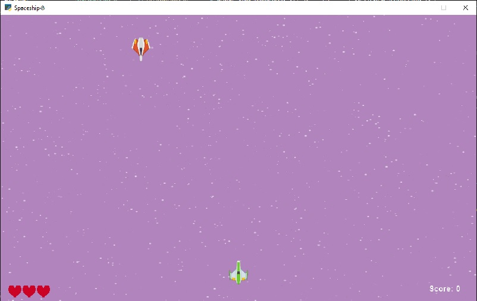
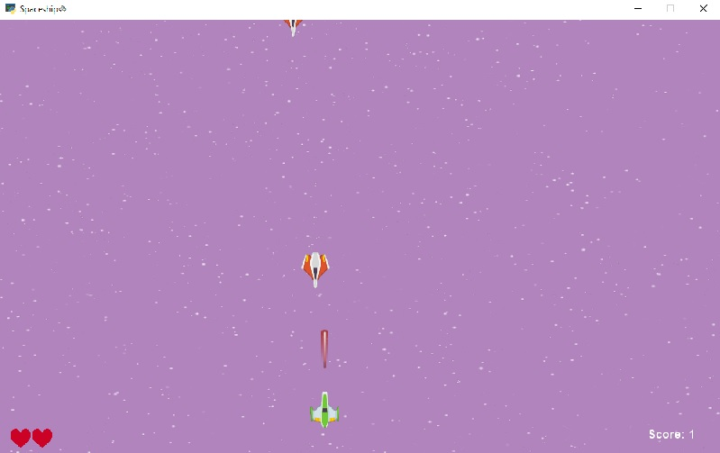
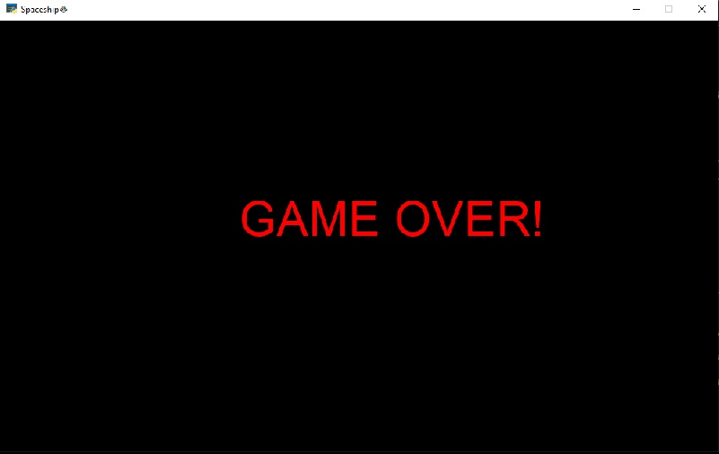

# arcadegame1
arccade-spaceship game🛸
---
Language: Python

Module: [arcade](https://api.arcade.academy/)

Method: Object oriented programming **(OOP)**

---

---
## Functions
Left arrow key or "D": go to left

Right arrow key or "A": go to right

Space key: Fire

